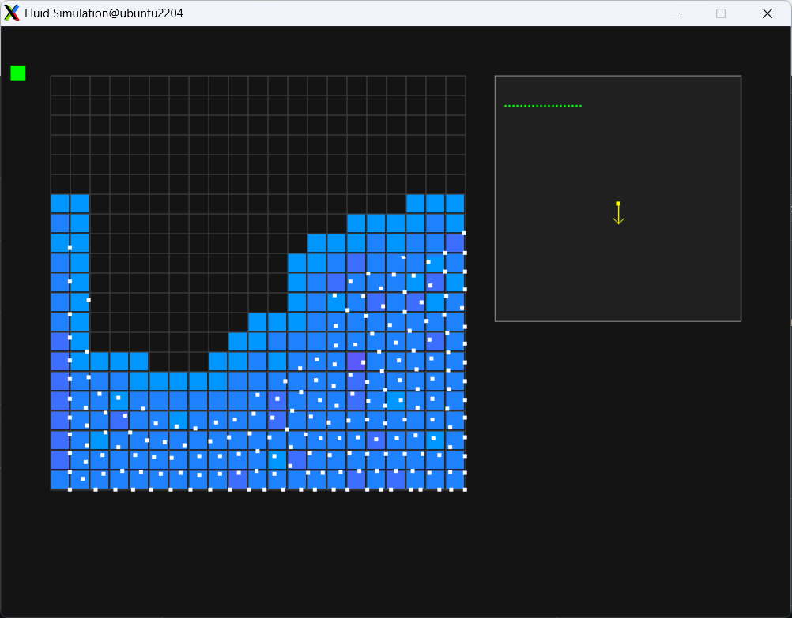

# Fluid Simulation

A real-time FLIP (Fluid Implicit Particle) fluid simulation implemented in C with SDL2 visualization.



## Features

- **FLIP Fluid Simulation**: Particle-based incompressible fluid dynamics
- **Real-time Visualization**: Interactive SDL2 rendering with grid display
- **Gravity Control**: Change gravity direction with arrow keys
- **Display Modes**: Switch between smooth and classic visualization
- **Interactive Particles**: Add particles with mouse clicks

## Controls

| Key | Action |
|-----|--------|
| `SPACE` | Pause/Resume simulation |
| `R` | Reset simulation |
| `↑/↓` | Add/Remove particles |
| `←/→` | Set gravity left/right |
| `U/D` | Set gravity up/down |
| `G` | Toggle gravity down/off |
| `M` | Toggle display mode |
| `Left Click` | Add particles at cursor |
| `ESC` | Exit |

## Display Modes

- **🟢 Smooth Mode**: Density-based coloring, fills gaps between particles
- **🟣 Classic Mode**: Simple blue cells, shows individual particle positions

## Build & Run

### Linux/Ubuntu
```bash
sudo apt-get install libsdl2-dev
make
./fluid_sim
```

### macOS
```bash
brew install sdl2
make
./fluid_sim
```

### Windows (MinGW)
```bash
# Install SDL2 development libraries
make
./fluid_sim.exe
```

## Implementation

Based on the FLIP method combining:
- **Particle advection** for detail preservation
- **Grid-based pressure solving** for incompressibility
- **Velocity transfer** between particles and grid
- **Collision handling** with boundaries

The simulation runs at 60 FPS with configurable parameters for accuracy vs performance.
